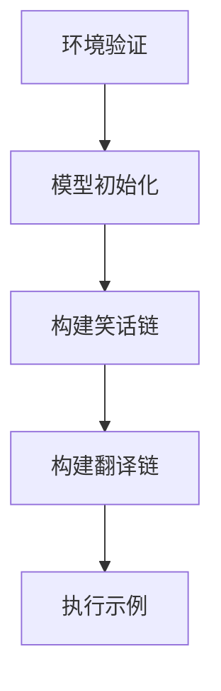

# LCEL

## 什么是LCEL ？

LCEL（LangChain Execution Language）是一种专为语言模型应用开发设计的执行语言。它结合了LangChain和LangGraph的功能，旨在简化复杂推理任务的实现，并提供高效、可靠且可维护的代码结构。

LCEL 通过图形化界面和链式任务管理，帮助开发者更直观地构建和管理语言模型应用。它支持与外部数据源的集成，如数据库、API 和搜索引擎，提升应用的智能化和实用性。

主要特点包括：

- **任务链管理**：通过LangChain实现复杂逻辑链式推理任务。
- **图形化工具**：利用LangGraph创建与语言模型互动的图形化工具。
- **高效集成**：支持与多种外部数据源的无缝集成。
- **易于维护**：提供清晰的代码结构和最佳实践，确保项目的长期可维护性。

LCEL 是构建基于语言模型应用的强大工具，适用于需要高效处理和管理复杂推理任务的开发场景。


## Demo 实现解析

### 模块概述

本示例演示如何使用 LCEL 构建包含错误处理和配置验证的链式语言模型工作流，主要实现以下功能：

- 环境变量验证与模型初始化
- 笑话生成与翻译的链式处理
- 类型安全的组件组合
- 带回退机制的异常处理

### 核心组件说明

#### 1. 配置验证

```python
def validate_environment() -> None:
    """验证必需的环境变量"""
    if not all([_DEEPSEEK_API_KEY, _DEEPSEEK_API_BASE]):
        raise EnvironmentError("缺少必需的环境变量")
```

- 使用严格的环境变量检查确保服务可用性
- 采用Python标准异常处理机制

#### 2. 模型初始化

```python
def initialize_model() -> ChatOpenAI:
    """初始化配置化的聊天模型"""
    return ChatOpenAI(
        model=_MODEL_NAME,
        api_key=_DEEPSEEK_API_KEY,
        base_url=_DEEPSEEK_API_BASE,
        temperature=0.7,
        max_tokens=150
    )
```

- 支持自定义API端点配置
- 包含关键生成参数（temperature, max_tokens）

#### 3. 处理链构建

```python
def create_joke_chain(llm: ChatOpenAI) -> RunnablePassthrough:
    """创建笑话生成链"""
    return (
        RunnablePassthrough.assign(topic=itemgetter("topic"))
        | joke_prompt
        | llm
        | StrOutputParser()
    )
```

- 使用 LCEL 管道运算符(|)组合组件
- 通过 RunnablePassthrough 实现数据流传递
- 集成 Prompt -> Model -> OutputParser 标准处理流程

### 执行流程



### 最佳实践

1. **环境隔离**：通过环境变量管理敏感配置
2. **组件复用**：使用函数式编程构建可组合的处理链
3. **错误隔离**：try-except 块包裹核心执行逻辑
4. **类型注解**：全程使用Python类型注解保证代码健壮性

### 示例输出

```bash
Generated Joke: Why did the ice cream go to school? It wanted to get a little "sundae" education!
Translated Joke: 为什么奥巴马去图书馆？他想提高自己的"知识"水平！
```

## 文档

- [expressiAdvantages of LCEL](https://python.langchain.com/v0.1/docs/expression_language/why/)