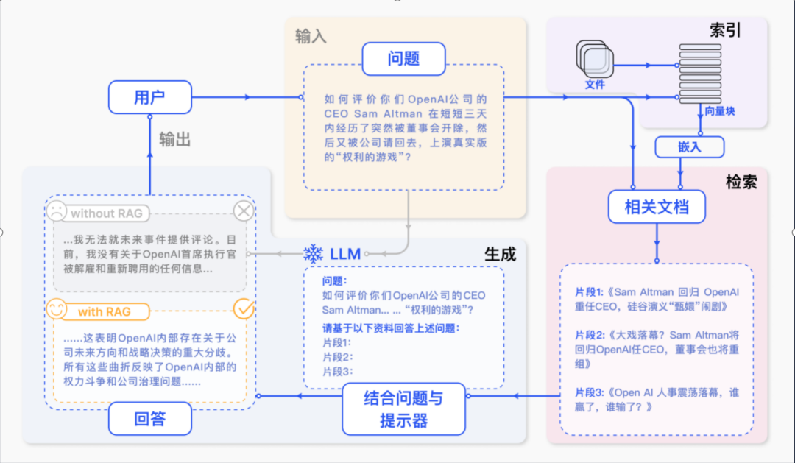

# RAG（Retrieval-Augmented Generation）

## 定义与原理

RAG（检索增强生成）是一种结合信息检索与生成模型的技术。其核心原理在于，当生成模型需要输出时，不仅依赖于自身的知识和推理能力，还通过信息检索系统从外部知识库获取相关信息，以增强生成结果。这种方法的优势在于，能够利用大量非结构化文本数据，为生成模型提供更丰富、准确的背景信息和参考知识。

## 工作原理

### 1. 检索阶段
在此阶段，系统从大规模知识库或文档集合中检索与输入查询相关的信息。

### 2. 生成阶段
根据检索到的信息，生成高质量的文本输出。

## 技术架构

1. **检索模块**
   - 负责从知识库中检索与输入查询相关的信息。
   - 使用预训练的双塔模型（dual-encoder）进行高效向量化检索。
   - 输出若干与查询相关的文档或段落，作为生成模块的输入。

2. **生成模块**
   - 根据检索到的信息生成高质量文本输出。
   - 使用预训练语言模型（如GPT-3）进行文本生成。
   - 生成模块通常包括解码器（decoder）和编码器（encoder），编码器处理检索到的信息，解码器生成最终文本输出。

3. **融合模块**
   - 将检索到的信息与生成模块的输出进行融合，生成最终文本输出。
   - 使用注意力机制（attention）将检索信息与生成输出融合。

## 参考文献

- [LangChain 中文文档](http://python.langchain.com.cn/)
- [RAG技术架构与实现原理](https://cloud.tencent.com/developer/article/2436421)
- [检索增强生成(RAG)技术方法流程最佳实践实验探索](https://www.53ai.com/news/RAG/2024072130482.html)
- [RAG框架](https://www.53ai.com/news/RAG/2024062056319.html)
- [RAG流程优化（微调）的4个基本策略](https://cloud.tencent.com/developer/article/2433287)